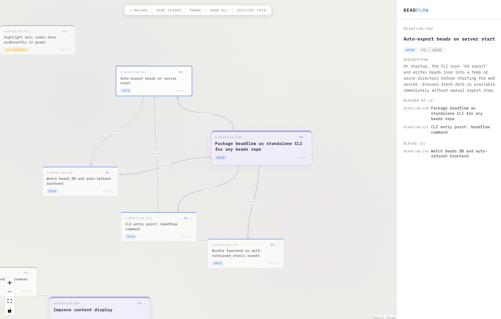

# beadflow

A graph-based knowledge browser. Navigate your beads (notes/issues) as an interactive force-directed graph with a detail sidebar.



## Features

- Force-directed graph visualization of bead relationships
- Sidebar with bead details and related beads
- Click-to-focus navigation with browser history
- Stable layout for large graphs (40+ nodes)

## Usage

```bash
npx beadflow          # serve from current directory
npx beadflow --port 3000
```

Or install globally:

```bash
npm install -g beadflow
beadflow
```

## Development

```bash
npm install
npm run dev      # dev server at http://localhost:5173
npm run build    # production build → dist/
npm run lint
```

## License

MIT

---

*This project was built with assistance from [Claude](https://claude.ai) (Anthropic).*
